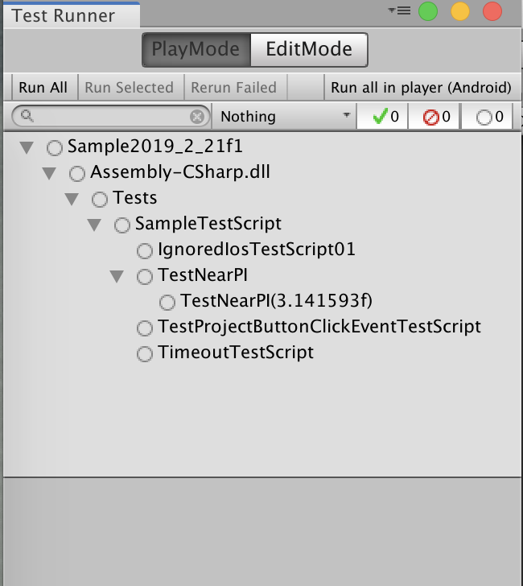

# Unity Test Framework

## 前提条件

### 確認したUnityバージョン

```sh
2019.2.21f1
```

## 導入方法

- Unityの```Package Manager```から以下をインポート

```sh
Test Framework
```


- Unityの```Test Runner```を起動


- 初回起動時は以下


- ウィンドウのタイトルバーにある三本線アイコンをクリック


- ```Enable playmode tests for all assemblies```を選択

- Unityを**再起動**する

- Unityの```Test Runner```を起動し、以下になっていれば準備完了


## テストスクリプト作成方法

- ```Test Runner```内のモード選択から```PlayMode```を選択

- Unityの```Project```窓で```Assets```を選択する


- ```Test Runner```の```PlayMode```内のボタンから```Create Test Script in current folder```をクリック
  
- **警告！決して```Create PlayMode Test Assembly Folder```を選んではいけない！もし選んでしまったら…**


- **（Testsフォルダと新規シナリオスクリプトは作成されるが、そこからプロジェクトのスクリプトクラスなどにはアクセス出来ない、という現象を確認）**

- ```Assets```直下に新規テストスクリプトが作成されるので、適切な名前を付ける


## シナリオの書き方

### テスト例

- 「Button」クリック時の動作テスト


- テストスクリプトをエディタで開き、シナリオを書く

[テストスクリプト例](SampleTestScript.cs)

- ```Test Runner```にテストシナリオが反映されているのを確認



### 注意点

- ```Assert```クラスはUnity標準を用いる

```c#
using Assert = UnityEngine.Assertions.Assert;
```

- テスト前に必ず対象の```Scene```を指定する

```C#
// Setup for test exec
[SetUp]
public void Init()
{
    // Load a scene for test
    SceneManager.LoadScene("MainScene");
}
```

## 実機テスト

- あらかじめ実機での通常動作が正常なのを確認

- ```Test Runner```内の階層窓からテストしたいカテゴリを選択

- ```Test Runner```内のタブバーから```Run all in player (現在のターゲット)```をクリック

### Androidの場合

- ```Run all in player (Android)```をクリックするとビルドからテスト実行まで自動でやってくれる

- テストの結果は```Test Runner```上で確認できる

### iOSの場合

- ```Run all in player (iOS)```をクリックすると```Xcode```プロジェクトの出力まではやってくれる

- ```Xcode```から```Run```すればテストが開始される

- テストの結果は```Test Runner```上で確認できる

### 補足

- テストを実行するアプリはOSホーム上で新たに作成される（AndroidとiOSで共通）


## テストは成功した、しかし…

### なぜ```Create PlayMode Test Assembly Folder```が正しく動作してくれないのか？


---

Copyright (C) 2020 東亜プリン秘密研究所. All rights reserved.
